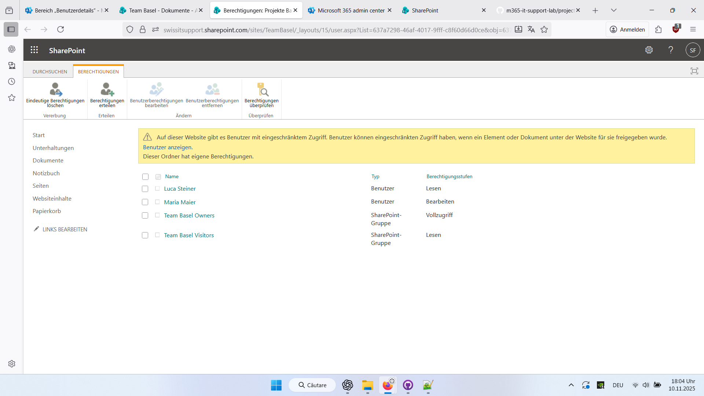
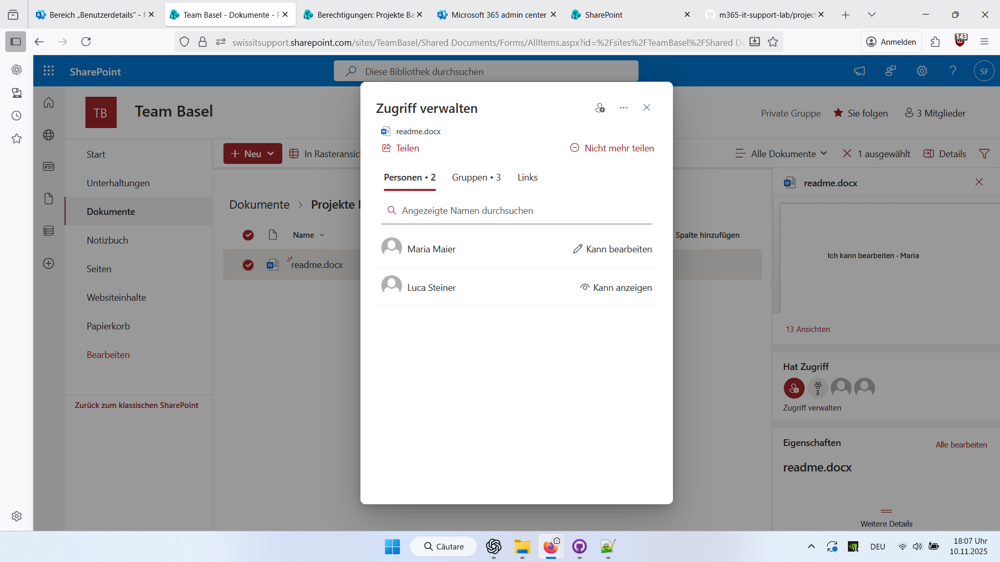
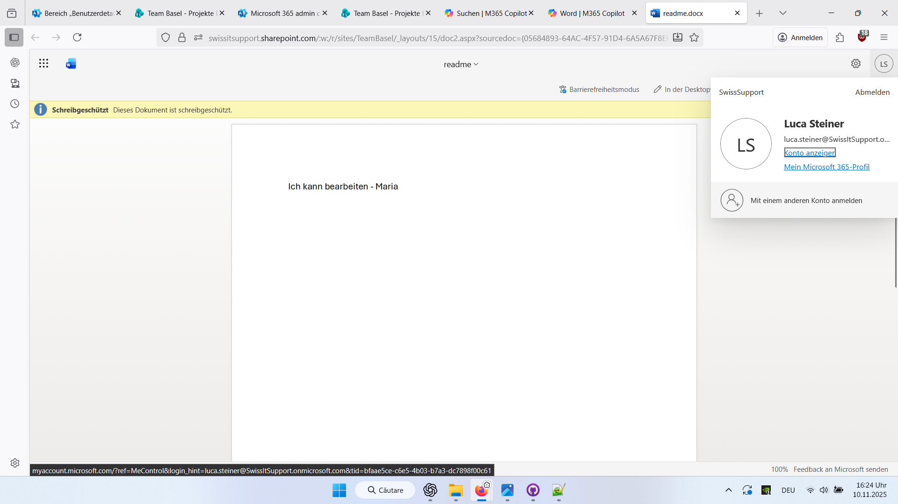
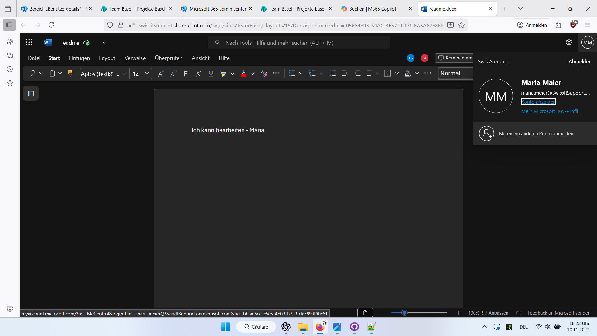

#  SharePoint Berechtigungen Lab

** Ziel:**  
Simulation der Konfiguration und Überprüfung von Benutzerberechtigungen in Microsoft SharePoint für verschiedene Rollen: Administrator, Bearbeiter und Leser.

##  Benutzer und Rollen

| Benutzer | Rolle in der Organisation | Zugriffsrechte |
|-----------|----------------------------|----------------|
| **Stefana Flesariu** | Administratorin |  Vollzugriff |
| **Maria Maier** | Benutzerin 1 |  Bearbeiten |
| **Luca Steiner** | Benutzer 2 |  Anzeigen (Nur-Lesen) |

##  Schritte

1. Erstellung der SharePoint-Website Team Basel
2. In der Dokumentbibliothek wurde der Ordner Projekte Basel angelegt  
3. Datei readme.docx zum Testen hochgeladen  
4. Berechtigungen geöffnet → Berechtigungen überprüfen
5. Vererbung deaktiviert → Vererbung beenden 
6. Individuelle Berechtigungen vergeben:  
   - Maria Maier → Bearbeiten  
   - Luca Steiner → Anzeigen  
   - Stefana Flesariu → Vollzugriff
7. Zugriff mit den Benutzerkonten getestet:  
   - Maria konnte das Dokument bearbeiten 
   - Luca sah die Meldung „Schreibgeschützt – Dieses Dokument ist schreibgeschützt”

## Screenshots

- folder_permissions.png →   
- file_permissions.png →   
- readonly_luca.png → 
- edit_maria.png → 

